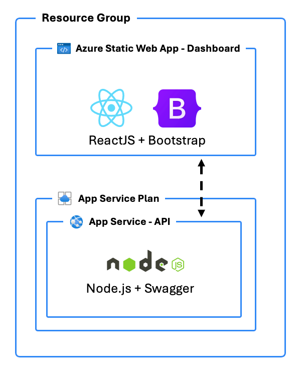
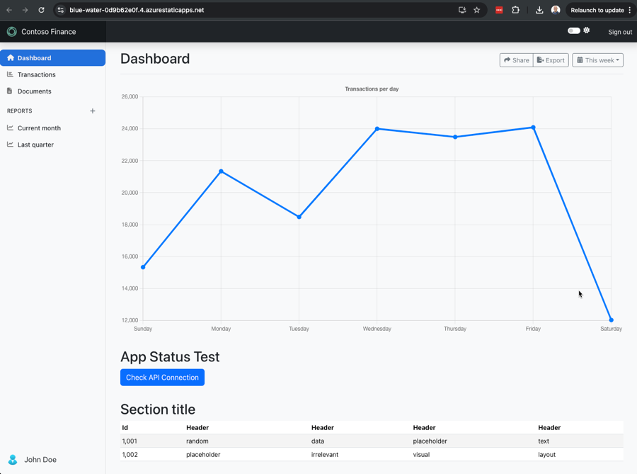

# azd-react-bootstrap-dashboard 
An `azd` template providing a React.js App + Bootstrap 5 front-end dashboard app with backend Node.js API app hosted in Microsoft Azure Static Web Apps and App Service.

To use this template, run the following command using the [Azure Developer CLI](https://learn.microsoft.com/azure/developer/azure-developer-cli/overview):

```bash
azd init --template build5nines/azd-react-bootstrap-dashboard
```

Architecture diagram of Azure resources:



### Dashboard UI

Here's a screenshot of what the Dashboard UI built with React.js and Bootstrap looks like:



## Author

This template was written by [Chris Pietschmann](https://pietschsoft.com), founder of [Build5Nines](https://build5nines.com), Microsoft MVP, HashiCorp Ambassador, and Microsoft Certified Trainer (MCT).
