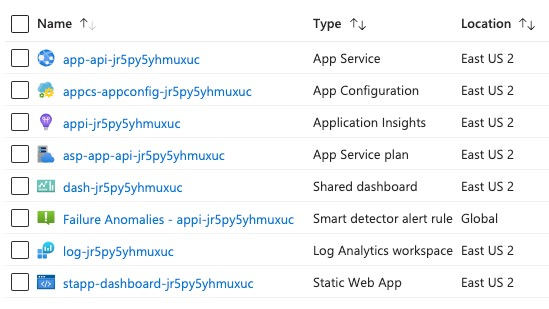
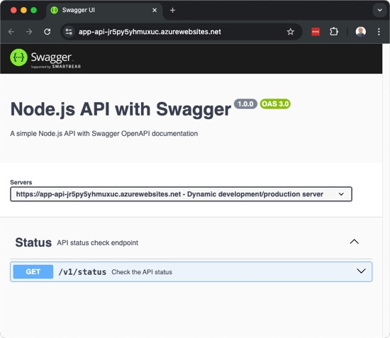

# azd-react-bootstrap-dashboard 

An `azd` template providing a React.js App + Bootstrap 5 front-end dashboard app with backend Node.js API app hosted in Microsoft Azure Static Web Apps and App Service.

To use this template, follow these steps using the [Azure Developer CLI](https://learn.microsoft.com/azure/developer/azure-developer-cli/overview):

1. Log in to Azure Developer CLI. This is only required once per-install.

    ```bash
    azd auth login
    ```

2. Initialize this template using `azd init`:

    ```bash
    azd init --template build5nines/azd-react-bootstrap-dashboard
    ```

3. Use `azd up` to provision your Azure infrastructure and deploy the web application to Azure.

    ```bash
    azd up
    ```

## Architecture Diagram


## Azure Resources

These are the Azure resources that are deployed with this template:

- **Azure App Configuration** - An App Config service that can be used for app configuration.
- **Azure App Service Plan** - The App Service Plan used to host the API application.
- **Azure App Service** - The App Service where the Node.js based API application is deployed.
    - Setup with _"System Assigned"_ Managed Identity used for authenticating access to App Configuration.
- **Azure Application Insights** - For application logging
- **Azure Log Analytics workspace** - Required for Application Insights logging
- **Shared dashboard** - Custom dashboard in the Azure Portal for monitoring
- **Failure Anomalies - Smart detector alert rule** - Failure Anomalies notifies you of an unusual rise in the rate of failed HTTP requests or dependency calls.
- **Azure Static Web App** - The static website hosting for the Dashboard front-end, SPA (single page application) application built with React.js.



## Dashboard UI

Here's a screenshot of what the Dashboard UI, built with React.js and Bootstrap, looks like:


## API Swagger UI

Here's a screenshot of the API application, built with Node.js, that exposes the Swagger UI:



## Author

This template was written by [Chris Pietschmann](https://pietschsoft.com), founder of [Build5Nines](https://build5nines.com), Microsoft MVP, HashiCorp Ambassador, and Microsoft Certified Trainer (MCT).
